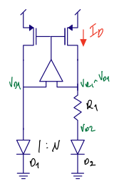
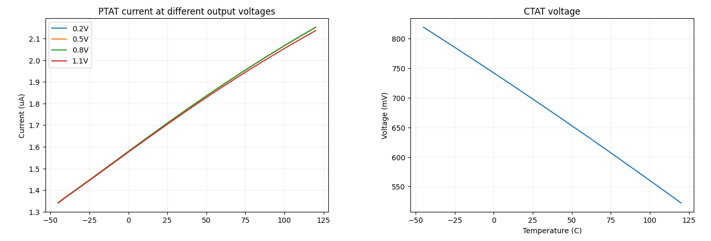
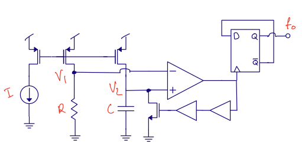
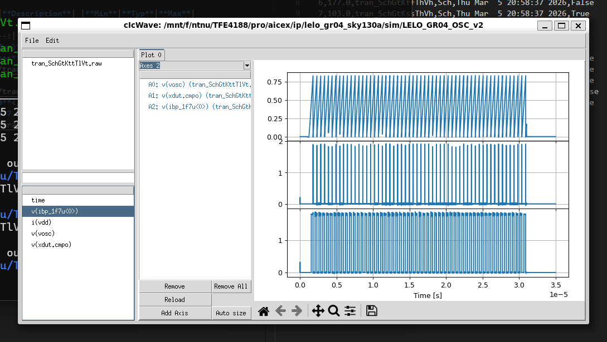
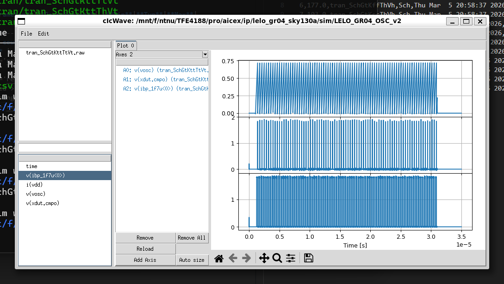
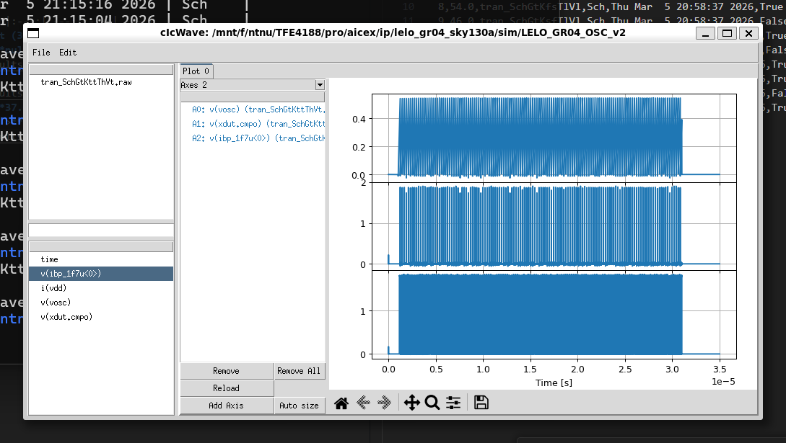
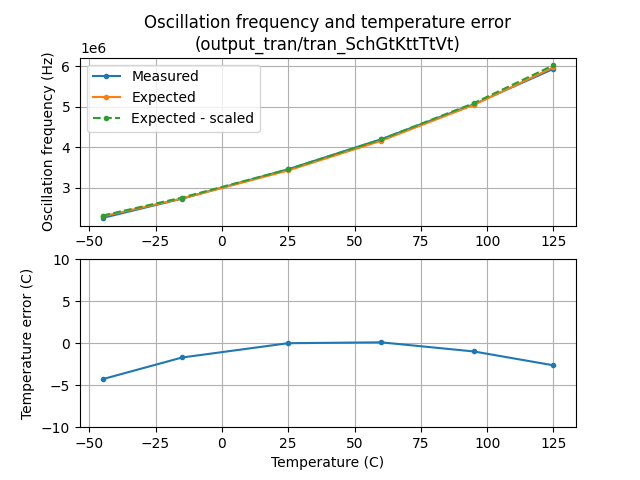
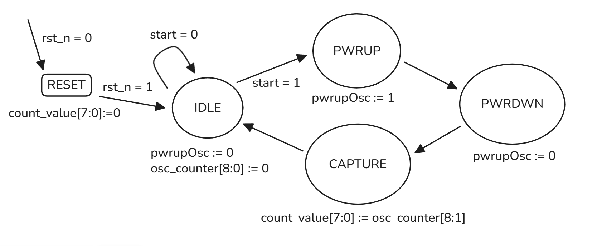
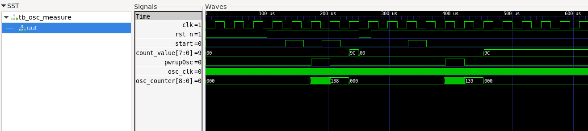

## Table of Contents
- [Who](#who)
- [Why](#why)
- [How](#how)
  - [Bandgap circuit](#bandgap-circuit)
    - [Mini Theory](#mini-theory)
    - [Design Parameters and Values](#design-parameters-and-values)
    - [MOSFET Configurations & Sizing](#mosfet-configurations--sizing)
    - [Result](#result)
  - [Oscillator](#oscillator)
    - [Theory](#theory)
    - [Implementation](#implementation)
    - [Result](#result-1)
  - [Digital counter](#digital-counter)
    - [Theory](#theory-1)
    - [Testbench](#testbench)
- [What](#what)
- [Signal interface](#signal-interface)
- [Key parameters](#key-parameters)

# Who
Wulff

Nick

Quannham

Raquel

# Why

To generate a **PTAT (Proportional To Absolute Temperature)** current and a **CTAT (Complementary To Absolute Temperature)** voltage, we use a bandgap reference circuit.

# How

## Bandgap circuit

### Mini Theory

The design is according to [Milestone 1](https://analogicus.com/aic2026/the_project#milestone-1-the-bandgap) of the project:

The two diodes carry the same current $I_D$, forced by the operational amplifier, so: 

$$\Delta V_D = V_{D1} - V_{D2} = V_T \ln\left(\frac{I_D}{I_{S1}}\right) - V_T \ln\left(\frac{I_D}{I_{S2}}\right) = V_T \ln\left(\frac{I_{S2}}{I_{S1}}\right) \Rightarrow \Delta V_D = V_T ln(N)$$

which is **PTAT**. $N$ is the current density ratio between the two diodes, and if they have the same current, then $N$ is also the effective area ratio of the p-n junctions.

The op-amp forces the top node voltages equal, giving:

$$V_{D1} = V_{D2} + I R_1 \Rightarrow I = \frac{\Delta V_D}{R_1} = \frac{kT}{qR_1}\ln(N)$$

Therefore the circuit generates a PTAT current.

If we want to create a bandgap reference, mirroring this current into a branch with $R_2$ and diode $D_3$ gives:

$$V_{\text{REF}} = V_{D3} + I R_2 = V_{D3} + \frac{R_2}{R_1}\Delta V_D$$

Since $V_{D3}$ is **CTAT** and $\Delta V_D$ is **PTAT**, choosing the ratio $\frac{R_2}{R_1}$ such that $\frac{dV_{\text{REF}}}{dT}=0$ allows us to cancel the temperature dependence.

Since we want a **temperature sensor** instead of a stable reference, we measure the $I_{\text{PTAT}}$ directly.

### Design Parameters and Values

| Parameter | Specification / Target | Notes |
| :--- | :--- | :--- |
| **Diode Resistor ($R_{\text{diode}}$)** | $\approx 30\text{ k}\Omega$ | Using RPPO4 |
| **p-n junction ratio** | 8 | Diode-connected BJTs  |
| **IPTAT @ 25C** | $\approx 1.78\mu A$ | |
| **Input MOSFET Pair** | 5F0 | Differential pair |
| **Tail Resistor ($R_{\text{tail}}$)** | RPPO2 | |
| **Bias Current ($I_D$)** | $1.8\mu\text{A} \to 7\mu\text{A}$ | Target: $\approx 5\mu\text{A}$ |
| **Settling time constant ($\tau$)** | $0.2\mu\text{s}$ | $\tau = R_{\text{out}}C_C$ |
| **Compensation ($C_C$)** | $\approx 0.1\text{ pF}$ | Given $R_{\text{out}} \approx 2\text{ M}\Omega$ |

---

### MOSFET Configurations & Sizing

**Input Pair & Tail Resistor**

The BJT used is the default PNP in the [JNW_TR_SKY130A](https://github.com/analogicus/jnw_tr_sky130A) library. A 1:8 ratio was chosen to ease layout and gradient effects later. $V_{be}$ is roughly 0.7-0.85 V at room temp, and this is the common mode input voltage. Based on this a PMOS input pair was chosen.

The available transistors are in the [JNW_ATR_SKY130A](https://github.com/analogicus/jnw_atr_sky130A) library. We want the following criteria:

- **Low mismatch**: requiring larger transistors (5F0 and preferably wide transistors).
- **gm/id = 15**: with 10, the $V_{sg}$ of 5F0 transistors are too high for the tail resistor.
- **Rtail $\in$ [15k, 120k]**: the JNW_TR_SKY130A provides this range of resistors (RPPO2 -> RPPO16), and we do not want to exceed them to save area.
- **Cc $\in$ [50nF, 500nF]**: the JNW_TR_SKY130A provides 50nF (X1) and 200nF (X4) capacitors. The settling time of the bandgap circuit should be ~ 1us to give time for the rest of circuit. This means $\tau = r_{out}C_c \approx 0.2us$.

Based on the available components, we select $I_{bias} \approx 5\mu A$ and RPPO2 resistor (15k $\Omega$). This gives ~ 150 mV voltage drop across the resistor, but this will change a lot depending on $V_{icm}$.

To pass $5 \mu A$ current at $g_m/I_D = 15$:

* **Option A:** $5 \times 8C\ 5F0$
* **Option B:** $4 \times 12C\ 5F0$

We finally selected $4 \times 8C\ 5F0$, resulting in slightly lower current for power and area optimization.

**Differential Pair Active Load**
We want the NMOS pair to pass $5 \mu A$ each, but we do not want them in too weak inversion. More importantly, we also want output resistances to be on the order of the PMOS input pair. $4 \times 8C\ 5F0$ PMOS in weak inversion has roughly $10M \Omega$ output resistance.

Choosing compensation capacitance $C_c = 0.1pF$, $r_{out} = \tau / C_c \approx 2M\Omega$.

From these two points, we select $2C\ 5F0$ NMOS transistors as active load pair.

**Current Mirror For BJT Pair**

We want good matching between them and relatively high output resistance -> use 5F0 devices.

Using the **5F0** device with $\approx 2\mu\text{A}$ bias:
* **Configuration:** $4C\ 5F0$
* **Operating Window:** $0.5\mu\text{A} \to 3.19\mu\text{A}$ for $g_m/I_D$ values between $15 \to 10$.

**Start Up Circuit**

We first tried Razavi’s simple timing circuit to initially keep node `Vp` low. We use a NMOS, which draws current from `Vp` untill VDD stabilizes.

However, this led to large leakage current for some reason. So instead, we directly couple `Vp` to the drain of the gating transistor of the bandgap.

<!-- Turns out it is need some very large values for RB and CB so we replace RB with a long , narrow MOSFET operating in triode region and bias with a small overdrive voltage 
(small width keeps the Resistance high). -->

**Stability**

Since we first have a very low Phase Margin (~ 25°), we use the dominant pole compensation method to increase it.

When PM = 55°: $f_t$ = 22MHz, loop gain = 7.5dB = 2.37. 

Therefore Cc >= 2.37 times X1, so we replace X1 with X4. This pushed the PM to 60°. Of course, there is a trade-off between the covering area and the phase margin. We can also add a resistor for lead compensation later.

**Regulated Cascode**

Following the example in Razavi's, we added a regulated cascode at the PMOS mirror outputs. However, simulation shows that the drain voltages of the PTAT PMOSes are too low, so `VCASCP` simply goes directly to GND. 

<!-- We also use a simple CS – CG pair for mirroring the current so the reference voltage is more precise  -->

### Result

The simulated IPTAT is not so linear, but may work well enough in the 0°-100°C range. The VCTAT is slightly better, so perhaps a better output mirror structure could improve this IPTAT.

## Oscillator

### Theory

The oscillator is based on [Milestone 2](https://analogicus.com/aic2026/the_project#milestone-2-the-oscillator):

where the capacitor is charged by a PTAT current up to a CTAT voltage, both of which are supplied by the bandgap. The inverters provide a slight delay for the comparator to fully discharge the capacitor, restarting the cycle.

The change of voltage of the capacitor is given by:

$$\frac{dV_{C}}{dt} = \frac{I_{ptat}}{C}$$

Given constant $I_{ptat}$, the charging duration is:

$$ T_{charge} = V_{ctat} \times C / I_{ptat}$$

If assuming the discharge is instantaneous, the oscillation frequency is:

$$ f_{osc} = I_{ptat} / (CV_{ctat}) $$

Choosing the capacitor to be 4x CAPX4, each composed of 4 CAPX1 that are 53.8 fF each, and using the following values for $I_{ptat}$ and $V_{ctat}$ (from typical bandgap simulation):

| Quantity            |        Value |
| :----           |  :----:       |
| `IPTAT @ 25C` | 1.693 uA |
| `IPTAT temperature coefficient` | 4.958 nA/K |
| `VCTAT @ 25C` | 708.725 mV |
| `VCTAT temperature coefficient` | -1.786 mV/K |

We arrive at the following expected oscillation frequencies at different temperatures:

| Temperature | Expected frequency |
| :----           |  :----:       |
| -45 C | 1.875 MHz |
| 25 C | 2.775 MHz |
| 125 C | 4.797 MHz |

The actual oscillation frequencies can change, depending on layout parasitics and process corners.

### Implementation

The oscillator currently uses a second comparator to compare capacitor voltage with half the $V_{ctat}$ voltage, since the D flip-flop is not tested yet. It can be implemented later to reduce current usage. 6 inverters are used to delay the comparator output.

### Result

The following are the plots of capacitor voltage, comparator output, and oscillator output at different temperature corners. Process and voltage are typical.

The plot of oscillation frequency vs. temperature at typical process and voltage is below. The scaled curve is the expected curve scaled (calibrated) to the measurement at 25C. The temperature error predicted by this curve is in the second plot.

Plots of other corners can be found in [the same folder](./sim/LELO_GR04/results/output_tran). The majority of them deviate from the expected curve, but the calbiration helps address this. Likely sources of errors are the non-zero delay of the comparator, and the transient startup of the bandgap. 

## Digital counter

### Theory

The digital counter is simple and implemented as the state machine shown below. The reset is asynchronous and active low. When a `start` signal is received, the analog part is enabled via `pwrupOsc` for one 32kHz cycle. In this time, `osc_counter[8:0]` is incremented using the `OSC_TEMP_1V8` signal from analog. 9 bits are used here to accommodate a maximum oscillation frequency of ~16MHz. After the 32kHz finishes, the 8 MSBs are sent to output (`count_value[7:0]`).

From simulations, the actual frequency of the oscillator can reach up to 8MHz due to variations.

### Testbench

To test the digital, a 10MHz clock (`osc_clk`) is generated parallel to the 32kHz clock (`clk`). The counter should record ~312 cycles, which is what we see on the `osc_measure[8:0]` signal (`0x138` - `0x139`). It's binary representation is `1_0011_1000`, and the 8 MSBs are `1001_1100` (`0x9C`). This is the output at `count_value[7:0]`. A reset is done mid-simulation to show its functionality.

# What

| What            |        Cell/Name |
| :----           |  :----:       |
| Schematic       | design/LELO_GR04_SKY130A/LELO_GR04.sch |
| Layout          | design/LELO_GR04_SKY130A/LELO_GR04.mag |

# Signal interface

| Signal       | Direction | Domain  | Description                               |
| :---         | :---:     | :---:   | :---                                      |
| VDD_1V8      | Input     | VDD_1V8 | Main supply                               |
| OSC_TEMP_1V8 | Output    | VDD_1V8 | Temperature dependent oscillation frequency|
| PWRUP_1V8    | Input     | VDD_1V8 | Power up the circuit
| VSS          | Input     | Ground  |                                           |

# Key parameters

| Parameter           | Min     | Typ             | Max     | Unit  |
| :---                | :---:   | :---:           | :---:   | :---: |
| Technology          |         | Skywater 130 nm |         |       |
| AVDD                | 1.7     | 1.8             | 1.9     | V     |
| Temperature         | -40     | 27              | 125     | C     |
